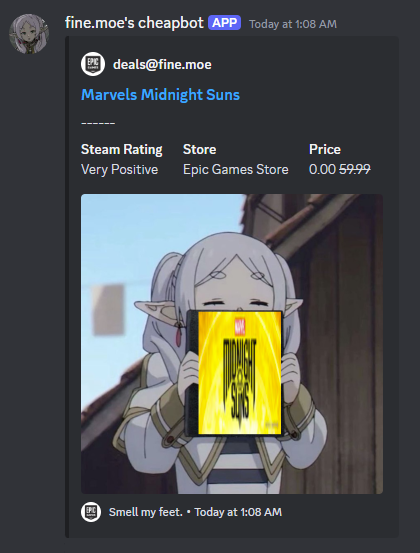

# fine.moe's cheapbot
A discord bot that alerts free games!

Brought to you by https://fine.moe, Cheapbot is a Discord bot designed to notify users about new free games. It checks for updates every hour and sends an alert to keep gamers informed about the latest opportunities to grab free games.

Uses Cheapshark API for pricing information.

## Run bot
[Click here to invite cheapbot to your server](https://discord.com/oauth2/authorize?client_id=1246213960047263797&permissions=51200&integration_type=0&scope=bot+applications.commands)

### Example notification

### Commands
- /fgregister 
    - Register your server to receive free game alerts.
- /fgunregister
    - Unregister your server from free game alerts.
- /freegames
    - Retrieve current free games.

### Environment
SETUP
npm -v
10.7.0

nodejs -v
v20.14.0

npm install discord.js sequelize sqlite3